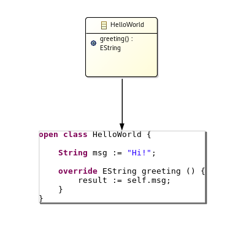

# ale-lang
Action Language for EMF

Ale is a language to define behaviors on the top of Ecore models.

Doc
===
* [Website](http://gemoc.org/ale-lang-compiler/)
* [Continous integration](https://ci.inria.fr/gemoc/job/ale-lang-compiler) 
* [Update site](http://www.kermeta.org/ale-lang-compiler/updates/)
* [Web site](http://www.kermeta.org/ale-lang-compiler/updates/)

# Dependecies

This project is a compiler for the [ALE metalanguage](http://www.kermeta.org/ale-lang-compiler/updates/).
